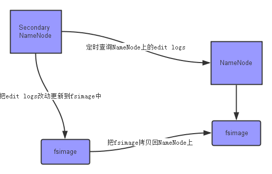

# Hadoop之HDFS

### HDFS的介绍

~~~
Hadoop分布式文件系统（HDFS）是一种分布式文件系统，设计用于在商用硬件上运行。它与现有的分布式文
件系统有许多相似之处。但是，与其他分布式文件系统的差异很大。HDFS具有高度容错能力，旨在部署在低成
本硬件上。HDFS提供对应用程序数据的高吞吐量访问，适用于具有大型数据集的应用程序。
文件以块的形式存在于文件系统
hadoop1 64M ------ hadoop2 128M ------ hadoop3 256M
~~~

### HDFS的架构

#### 架构图

#### 架构介绍

##### NameNode

~~~

NameNode：存储和管理HDFS元数据 接受IO请求 管理元数据 管理datanode

tips:
读取fsimage元数据镜像文件，加载到内存中。
读取editlog日志文件，加载到内存中，使当前内存中元数据信息与上次关闭系统时保持一致。然后在磁盘上生成一份同内存中元数据镜像相同的fsimage文件。生成新的 edit_inprogress正在进行的日志。
dfs.namenode.name.dir 元数据位置

~~~

##### DataNode

~~~

DataNode: 存储文件内容，维护blockid到datanode的映射关系,从节点 小弟角色（干活的） 负责clint端的读写请求 创建块，删除块，副本

tips:
正常节点 3秒要给namenode发送心跳
退役节点 10分钟以内 没有发送心跳
死节点 10分钟以后没有发送心跳 默认死亡
dfs.datanode.data.dir 数据节点位置

~~~

##### metadata

~~~
metadata: 元数据 包括 文件、目录自身的属性信息，例如文件名，目录名，修改信息等；文件记录的信息的存储相关的信息，例如存储块信息，分块情况，副本个数等；记录HDFS的Datanode的信息，用于DataNode的管理。

~~~

##### Client

~~~
client:客户端
~~~

##### Rack

~~~
rack:机架
~~~

##### replication

~~~
replicatioin:副本数
tips:
配置 dfs.replication 副本数
对于默认3 副本安置策略
1. 一个副本放在本地计算机上。初始副本
2. 在另一个（远程）机架上的节点上放置另一个副本。先保证安全
3. 最后一个在同一个远程机架中的另一个节点上。保证局部最快的恢复
由于NameNode不允许DataNode具有同一块的多个副本，因此创建的最大副本数是此时DataNode的总数。
~~~

##### block ops

~~~
block ops: 块操作 老大对小弟的块操作请求
~~~

### 快照以及日志

#### fsimage 快照

~~~
   保存了最新的元数据检查点，包含了整个HDFS文件系统的所有目录和文件的信息。对于文件来说包括了数据块描述信息、修改时间、访问时间等；对于目录来说包括修改时间、访问权限控制信息(目录所属用户，所在组)等。简单的说，Fsimage就是在某一时刻，整个hdfs 的快照，就是这个时刻hdfs上所有
的文件块和目录，分别的状态，位于哪些个datanode，各自的权限，各自的副本个数等
~~~

#### editlog 日志

~~~
   主要是在NameNode已经启动情况下对HDFS进行的各种更新操作进行记录，HDFS客户端执行所有的操作（读不会记录）都会被记录到editlog中。日志在集群运行的时候会以inprogress的后缀存在于文
件中等待 dfs.namenode.checkpoint.period和dfs.namenode.checkpoint.txns分别是1个小时和
1000000。只要达到这两个条件之一，secondarynamenode会执行checkpoint操作
~~~

#### 其他

~~~
FsImage和EditLog是HDFS的中心数据结构。这些文件损坏可能导致HDFS实例无法正常运行。因此，
NameNode可以配置为支持维护FsImage和EditLog的多个副本。对FsImage或EditLog的任何更新都会导致
每个FsImages和EditLogs同步更新。这种FsImage和EditLog的多个副本的同步更新可能会降低NameNode可以支持的每秒命名空间事务的速率。但是，这种降级是可以接受的，因为即使HDFS应用程序本质上是数据密集型的，它们也不是元数据密集型的。当NameNode重新启动时，它会选择要使用的最新一致FsImage和EditLog。
增加故障恢复能力的另一个选择是使用多个NameNode 在NFS上使用共享存储或使用分布式编辑日志（称
为Journal）来启用高可用性。后者是推荐的方法。
~~~

### HDFS的通信协议 

~~~
client和namenode之间是通过rpc通信;
datanode和namenode之间是通过rpc通信;
client和datanode之间是通过简单的socket通信;
datanode和datanode之间是tcp协议
namenode和secondarynamenode是http协议

----------------------------------------API----------------------------------------
DFSClient的代码，可以看到它有一个成员变量public final ClientProtocolnamenode;
DataNode的代码，可以看到它也有一个成员变量public DatanodeProtocolnamenode;
-------------------------------三种协议的对比---------------------------------------
网络分层
物理层、数据链路层、网络层、传输层、会话层、表示层和应用层。
---------------------------------------------------------------

HTTP - 应用层
http协议最显著的特点就是：客户端发送的每次请求，都需要服务端返回响应。客户端收到服务端的响应后，主动关闭连接。一次TCP连接过程完成。应用层协议 主要解决如何包装数据，如果没有应用层，便无法识别数据内容。http协议是建立在TCP协议之上的一种应用，是Web联网的基础，最显著的特点是客户端发送的每次请求都需要服务器回送响应，在请求结束后，会主动释放连接。从建立连接到关闭连接的过程称为“一次连接”。

TCP/IP - 传输层
TPC/IP协议是传输层协议，主要解决数据如何在网络中传输，TCP/IP协议是一个协议簇。里面包括很多协议的。UDP只是其中的一个。之所以命名为TCP/IP协议，因为TCP,IP协议是两个很重要的协议，就用他两命名了。

Socket
socket并不是一种协议，是在程序员层面上对TCP/IP协议的封装和应用。其实是一个调用接口，方便程序员使用TCP/IP协议栈而已。程序员通过socket来使用tcp/ip协议。但是socket并不是一定要使用tcp/ip协议，Socket编程接口在设计的时候，就希望也能适应其他的网络协议。

RPC -> 会话层
解决分布式系统中，服务之间的调用问题。
远程调用时，要能够像本地调用一样方便，让调用者感知不到远程调用的逻辑

~~~

### CheckPoint 

#### shell命令 

~~~
hdfs dfsadmin -rollEdits 滚动日志 
hdfs dfsadmin -saveNamespace 保存当前系统的快照 checkpoint 
~~~

#### 条件以及相关配置

~~~
dfs.namenode.checkpoint.period和dfs.namenode.checkpoint.txns分别是1个小时和1000000。只
要达到这两个条件之一，secondarynamenode会执行checkpoint操作
通常情况下，SecondaryNameNode每隔一小时执行一次CheckPoint,将滚动的Edits与fsimage合并
一分钟检查一次操作次数，当操作次数达到1百万时，SecondaryNameNode执行一次
~~~

~~~xml
<property>
    <name>dfs.namenode.checkpoint.period</name>
    <value>3600</value>
</property>
~~~

~~~xml
<property>
    <name>dfs.namenode.checkpoint.txns</name>
    <value>1000000</value>
    <description>操作动作次数</description>
</property>
<property>
    <name>dfs.namenode.checkpoint.check.period</name>
    <value>60</value>
    <description> 1分钟检查一次操作次数设置检查周期</description>
</property >
~~~

#### 非高可用集群的CheckPoint

~~~

NameNode
管理者文件系统的Namespace 他维护者文件系统树以及文件树的所有的文件和文件夹的元数据 

1. fsimage ： name启动时对整个文件系统的快照
2. edit logs：Name启动后 对文件系统的改动序列
tips:NameNode的edit的log是什么时候发生改变的       
我们往DataNode放入文件时 ，DataNode 会和NameNode通信 告诉NameNode 什么文件的第几个block放在它那里 。NameNode会将其写入到edit log。

需要解决的问题
当 Namenode重启以后 edit logs 就会合并到 fsimage 得到文件系统的最新快照 。但是在 产品集群NameNode是很少重启的 ，而namenode 运行了很长时间 edit log 就会变得很大 
1. edit logs 文件变得很大 怎么去管理这个文件 
2. Name Node的重启会花费很长时间 因为有许多edit log的改动要移动到 fsimage上     
3. 如果namenode挂掉了 我们就丢失了很多改动 因此此时的fsimage文件很久 （很久没有发生更新）

-->需要一个 能及时发现 edit log 修改 的文件 来更新快照fsimage 
~~~

~~~
SecondaryNameNode
通过定时 查询 namenode上的edit logs 来保证 fsimage的及时更新 时刻复制 active的Namenode工作节点的快照 。合并namenode 的 edit log 合并到 fsimage上 
1.定时获取active状态的namenode节点的 edit logs 并更新 到 fsimage [Secondary自己的image快照 ]
2.一旦有了新的fsimage文件，它将其拷贝会 NameNode 中
3.NameNode 在下次重启会使用这个新的fsimage文件 减少重启时间 
~~~

~~~
fs.checkpoint.dir 检查点目录存放合并好的快照信息元数据（时间 默认3600S和大小1000）secondary NameNode的元数据避免和工作目录放在同一个目录下 这样一来容易和fs.checkpoint目录一起凉掉
测试：删掉 name文件 使用命令将checkpoint中的数据导入 就可以恢复
~~~

#### 高可用集群的CheckPoint

##### JournalNodes进程

~~~
两个NameNode为了数据同步，会通过一组称作JournalNodes的独立进程进行相互通信。当active状态的NameNode的命名空间有任何修改时，会告知大部分的JournalNodes进程。standby状态的NameNode有能力读取JournalNodes中的变更信息，并且一直监控edit log的变化，把变化应用于自己的命名空间。standby可以确保在集群出错时，命名空间状态已经完全同步了。
     运行JournalNodes的计算机。JournalNode守护程序相对轻量级，因此这些守护程序可以合理地与其他Hadoop守护程序并置在机器上，例如NameNodes，JobTracker或YARN ResourceManager。**注意：**必须至少有3个JournalNode守护进程，因为编辑日志修改必须写入大多数JN。这将允许系统容忍单个机器的故障。您也可以运行3个以上的JournalNodes，但为了实际增加系统可以容忍的失败次数，您应该运行奇数个JN（即3,5,7等）。请注意，当使用N JournalNodes运行时，系统最多可以容忍（N-1）/ 2个故障并继续正常运行。
~~~

JornalNode的工作原理

~~~
1. hadoop.journalnode.edits.dir   配置Journal共享目录位置
2. 只有活跃状态的节点有权对journal的共享目录进行更改 在更改时如果有半数目以上的Journalnode节点更改成功就是为更改成功。
3. standby状态的NameNode有能力读取JournalNodes中的变更信息，并且一直监控edit log的变化，把变化应用于自己的命名空间
4. 确保快速切换，standby状态的NameNode有必要知道集群中所有数据块的位置。为了做到这点，所有的datanodes必须配置两个NameNode的地址，发送数据块位置信息和心跳给他们两个。 
5. 运行的JournalNode进程非常轻量，可以部署在其他的服务器上。注意：必须允许至少3个节点。当然可以运行更多，但是必须是奇数个，如3、5、7、9个等等。当运行N个节点时，系统可以容忍最多(N-1)/2(N至少为3)个节点失败而不影响正常运行。 
6. standby状态的NameNode可以完成checkpoint操作，因此没必要配置Secondary NameNode、CheckpointNode、BackupNode。如果真的配置了，还会报错
~~~

###  HDFS的优缺点

#### 优点

~~~
(1) 高容错性
    1) 数据自动保存多个副本。它通过增加副本的形式，提高容错性。
    2) 某一个副本丢失以后，它可以自动恢复，这是由 HDFS 内部机制实现的，我们不必关心。
(2) 适合批处理
    1) 它是通过移动计算而不是移动数据。
    2) 它会把数据位置暴露给计算框架。	
(3) 适合大数据处理
    1) 数据规模：能够处理数据规模达到 GB、TB、甚至PB级别的数据。
    2) 文件规模：能够处理百万规模以上的文件数量，数量相当之大。
    3) 节点规模：能够处理10K节点的规模。
(4) 流式数据访问
    1) 一次写入，多次读取，不能修改，只能追加。
    2) 它能保证数据的一致性。
(5) 可构建在廉价机器上
    1) 它通过多副本机制，提高可靠性。	
    2) 它提供了容错和恢复机制。比如某一个副本丢失，可以通过其它副本来恢复。
~~~

#### 缺点

~~~
(1) 不适合低延时数据访问；
    1) 比如毫秒级的来存储数据，这是不行的，它做不到。	
    2) 它适合高吞吐率的场景，就是在某一时间内写入大量的数据。但是它在低延时的情况  下是不行的，比如毫秒级以内读取数据，这样它是很难做到的。改进策略
(2) 无法高效的对大量小文件进行存储
    1) 存储大量小文件的话，它会占用  NameNode大量的内存来存储文件、目录和块信息。这样是不可取的，因为NameNode的内存总是有限的。
    2) 小文件存储的寻道时间会超过读取时间，它违反了HDFS的设计目标。 改进策略
(3) 并发写入、文件随机修改
    1) 一个文件只能有一个写，不允许多个线程同时写。
    2) 仅支持数据 append（追加），不支持文件的随机修改
~~~

### HDFS的上传文件 

~~~
上传文件的流程
1.首先hdfs客户端通过RPC调用向nn发送请求上传文件1.txt
2.元数据根据请求信息查询元数据 , 判断是否可以上传
3.返回可以请求上传 , 响应给客户端
4.将数据的块(blk-1)[采用3副本]上传到元数据中
5.根据请求 , 并且结合dn信息返回3台可以用的dn的ip(dn1,dn2,dn3)
6.nn返回上传副本的信息给客户端
7.客户端和dn1建立传输数据的管道(pipeline) , 与此同时 , dn1与dn2之间也建立传输数据的管道 , 直到最后一个为止
8.依次返回pipeline建立完毕信息 , 直到响应给客户端
9.传输数据包(packet) , 默认大小为64K , dn*把接收到的packet保存到指定的目录中 , 并且把packet继续往后发 , 直到最后一个
10.发送完毕后反方向追个返回ack应答 , 保证packet的安全稳定 , 直到返回给客户端
11.待第一块上传完毕 , 客户端按照上述流程走一遍 , 上传第二个块 , 从第4步开始 , 重新发起请求 , 寻找可用的dn位置
12.待所有块上传完毕 , 客户端把信息告知namenode , nn把信息同步到文件系统的元数据中
~~~

### HDFS的下载文件 

~~~
下载流程
1.Client向namenode发起RPC请求 , 确定请求文件block所在的位置
2.nn的元数据会对请求进行判断 , 根据情况返回文件的部分或者全部blk列表 , 且每个blk , nn都会返回含有该blk副本的datanode地址
3.返回的dn地址 , 会按照集群拓扑结构得出dn与客户端的距离并进行排序 , 排序两个规则：网络拓扑结构中距离 Client 近的排靠前；心跳机制中超时汇报的 DN 状态为 STALE，这样的排靠后
4.Client选取排序靠前的dn来读取blk , 若客户端本身就是dn , 那么直接从本地直接获取数据
5.底层上本质是建立Socket Stream(FSDataInputStream) , 重复的调用父类DataInputStream的read方法 , 知道这个块上的数据读取完毕
6.当读取完列表的blk之后 , 若文件读取还没有结束 , 客户端会继续向nn获取下一批的blk列表
7.读取完一个blk都会进行checksum验证 , 如果读取dn时出现错误 , 客户端会通知nn , 然后再从下一个拥有blk副本的dn继续读
8.read方法是并行的读取blk信息 , 不是一块一块的读取 , nn只返回Client请求包含块的dn地址 , 并不返回数据
9.最终读取来所有的blk合并成一个完整的文件
~~~

> > https://blog.csdn.net/CoderBoom/article/details/84112522

### HDFS的shell命令 

##### 常用的shell

~~~
1.浏览根目录下所有的hdfs文件   hdfs dfs -ls / 
2.递归浏览根目录下的hdfs文件    hdfs dfs -ls -R /
3.在根目录下创建test目录 hdfs  dfs -mkdir /test
4.递归创建根目录下的test/01/02  hdfs dfs -mkdir -p /test/01/02
5.创建根目录下的 test下的te.txt文件 hdfs dfs -touchz /test/te.txt
6.复制根目录下的test下的te.txt文件到 /yuniko/01 hdfs dfs -cp /test/01 /yuniko/01
7.移动test下的te.txt 到根目录 hdfs dfs -mv /test/te.txt /
8.本地文件当前目录下hadoop-2.5.2.tar.gz上传到hdfs 的根目录     hdfs dfs -put ./hadoop-2.5.2.tar.gz /
9.本地文件hadoop-2.5.2.tar.gz  copy到hdfs的/test文件夹下  hdfs dfs -copyFromLocal ./hadoop-2.5.2.tar.gz  /test
10.下载上传的hadoop-2.5.2.tar.gz到当前文件夹   hdfs dfs -get /hadoop-2.5.2.tar.gz ./
11.hdfs的文件copy到本地hdfs dfs -copyToLocal ./hadoop-2.5.2.tar.gz  /test
12.查看hdfs目录下 a.txt文件      
   hdfs dfs -tail /a.txt
   hdfs dfs -text /a.txt
   hdfs dfs -cat /a.txt
13.查看hdfs目录下文件大小分布 hdfs dfs -du /
14.查看hdfs目录下文件大小总和 hdfs dfs -du  -s /
~~~

##### HDFS安全模式的shell

~~~
hdfs dfsadmin -safemode enter 进入安全模式 
hdfs dfsadmin -safemode leave 退出安全模式 
hdfs dfsadmin -safemode get   获取当前安全模式的状态
~~~

#####  其他shell

~~~
查看datanode的状态打印报告
>> hdfs dfsadmin -report
hdfs dfsadmin -文件系统的管理命令 
hdfs haadmin  ha的管理工具
hdfs fsck 文件检测工具 
hdfs balancer 块的平衡
hdfs oiv fsimage文件查看转换成其他格式
hdfs oev edits文件查看转换成其他格式
hdfs dfsadmin -rollEdits 滚动日志 不需要进入安全模式
hdfs dfsadmin -saveNamespace    手动checkpoint 需要进入安全模式 
hdfs  getconf -namenodes 查看配置 
~~~

### HDFS的常用服务命令

~~~
启动全部服务
start-all.sh
启动单个服务
hadoop-deamon.sh ****** start 
hadoop-deamon.sh ****** stop
启动hdfs的服务
start-dfs.sh
stop-dfs.sh
~~~

### HDFS的安全模式

####  进入安全模式的情况

~~~
1. 分布式系统维护
2. 分布式系统启动时
3. 当可用副本数/总副本数小于99.999%
~~~

####  安全模式下的shell

~~~
进入安全模式    hdfs dfsadmin -safemode enter

离开安全模式   hdfs dfsadmin -safemode leave

获取系统当前状态 hdfs dfsadmin -safemode get 
~~~

#### 安全模式下的相关配置

~~~

dfs.namenode.replication.min： 最小副本数 在上传的时候默认达到最小副本数就认为上传成功

dfs.namenode.safemode.threshold-pct: 达到最小副本数的数据块的百分比。默认为0.999f。当小于这个比例，那就将系统切换成安全模式，对数据块进行复制；当大于该比例时，就离开安全模式，说明系统有足够的数据块副本数，可以对外提供服务

dfs.namenode.safemode.min.datanodes: 离开安全模式的最小可用 datanode 数量要求，默认为 0.也就是即使所有 datanode 都不可用，仍然可以离开安全模式

dfs.namenode.safemode.extension: 当集群可用 block 比例，可用 datanode 都达到要求之后，如果在 extension 配置的时间段之后依然能满足要求，此时集群才离开安全模式。

~~~

### HDFS的调优

~~~
1. dfs.datanode.failed.volumes.tolerated: 允许发生磁盘错误的磁盘数量，默认为0，表示不允许datanode发生磁盘异常。当挂载多个磁盘的时候，可以修改该值。
2. dfs.replication: 复制因子，默认3
3. dfs.namenode.handler.count: namenode节点并发线程量，默认10
4. dfs.datanode.handler.count：datanode之间的并发线程量，默认10。
5. dfs.datanode.max.transfer.threads：datanode提供的数据流操作的并发线程量，默认4096。
tips:
1.linux中是没有文件句柄的，只有文件描述符，只是大家习惯把它说成句柄。
2.linux中， 每当进程打开一个文件时，系统就为其分配一个唯一对应的整型文件描述符（从0开始），用来标识这个文件。linux 操作系统通常对每个进程能打开的文件数量有一个限制。默认是1024。
一般将其设置为linux系统的文件句柄数的85%~90%之间，查看文件句柄数语句ulimit -a，修改vim /etc/security/limits.conf, 不能设置太大
6. io.file.buffer.size: 读取/写出数据的buffer大小，默认4096，一般不用设置，推荐设置为4096的整数倍(物理页面的整数倍大小)。
~~~

### HDFS的API

#### 读取文件的内容 

~~~java
package HDFS;

import org.apache.commons.io.IOUtils;
import org.apache.hadoop.conf.Configuration;
import org.apache.hadoop.fs.FSDataInputStream;
import org.apache.hadoop.fs.FileSystem;
import org.apache.hadoop.fs.Path;
import org.apache.hadoop.util.RunJar;

import java.io.IOException;
import java.net.URI;
import java.net.URISyntaxException;

public class HDFS_HA_Reader {
    public static void main(String[] args) throws IOException, URISyntaxException, InterruptedException {
        Configuration conf = new Configuration();

      // 可以将 core-site.xml 或者 hdfs-site.xml放到资源目录吓死 
        conf.set("fs.defaultFS", "hdfs://yuniko");
        conf.set("dfs.nameservices", "yuniko");
        conf.set("dfs.ha.namenodes.yuniko", "nn1,nn2");
        conf.set("dfs.namenode.rpc-address.yuniko.nn1", "hadoop1:9000");
        conf.set("dfs.namenode.rpc-address.yuniko.nn2", "hadoop2:9000");
        conf.set("dfs.client.failover.proxy.provider.yuniko", "org.apache.hadoop.hdfs.server.namenode.ha.ConfiguredFailoverProxyProvider");
        conf.setBoolean("dfs.ha.automatic-failover.enabled",true);
        FileSystem fs = FileSystem.get(new URI("hdfs://yuniko"),conf,"hadoop");

        FSDataInputStream fsDataInputStream = fs.open(new Path("/mapreducetest/wordcount"));
        IOUtils.copy(fsDataInputStream,System.out);
    }
}
~~~

#### 获取节点的信息

~~~java
package HDFS;

import org.apache.commons.io.IOUtils;
import org.apache.hadoop.conf.Configuration;
import org.apache.hadoop.fs.*;
import org.apache.hadoop.hdfs.DFSClient;
import org.apache.hadoop.hdfs.DFSInputStream;
import org.apache.hadoop.hdfs.DistributedFileSystem;
import org.apache.hadoop.hdfs.protocol.DatanodeInfo;
import org.apache.hadoop.hdfs.server.namenode.SecondaryNameNode;

import java.io.IOException;
import java.net.URI;
import java.net.URISyntaxException;
import java.util.Arrays;

public class get_Node_Info {
    public static void main(String[] args) throws URISyntaxException, IOException, InterruptedException {
        Configuration configuration = new Configuration();
        configuration.set("fs.defaultFs","hdfs://hadoop1:9000");
        FileSystem fs = FileSystem.get(new URI("hdfs://hadoop1:9000"),configuration,"hadoop");

        FSDataInputStream fsDataInputStream = fs.open(new Path("/mapreducetest/wordcount"));
        FileStatus fileStatus =  fs.getFileStatus(new Path("/mapreducetest/wordcount"));
        System.out.println(fileStatus.getPath());
        System.out.println("------------------------------------------------------------------------");

        RemoteIterator<LocatedFileStatus> remoteIterator = fs.listFiles(new Path("/mapreducetest"),true);
        while(remoteIterator.hasNext())
        {
            LocatedFileStatus locatedFileStatus = remoteIterator.next();
            BlockLocation[] bs = locatedFileStatus.getBlockLocations();

            for(BlockLocation blockLocation :bs)
            {
                System.out.println(Arrays.toString(blockLocation.getNames()));
                blockLocation.getHosts();
                System.out.println(Arrays.toString(blockLocation.getHosts()));
                break;
            }
            break;

        }
        System.out.println("------------------------------------------------------------------------");
        DistributedFileSystem dfs = (DistributedFileSystem) fs;
        DatanodeInfo[] dataNodeStats = dfs.getDataNodeStats();
        for (DatanodeInfo di:dataNodeStats
             ) {
            System.out.println("容量 "+di.getCapacity()/1024/1024);
        }
        System.out.println(Arrays.toString(dataNodeStats));

    }
}

~~~

### HDFS的其他

#### 1.RPC通信协议

~~~

对于NameNode 、DataNode 、Client 之间的相互通信 使用RPC协议 
RPC（Remote Procedure Call）—远程过程调用，它是一种通过网络从远程计算机程序上请求服务，而不需要了解底层网络技术的协议。

~~~

#### 2.副本减少时HDFS的处理

~~~
当文件的复制因子减少时，NameNode选择可以删除的多余副本。下一个Heartbeat将此信息传输到DataNode。然后，DataNode将删除相应的块，并在群集中显示相应的可用空间。再一次，setReplication API调用完成与集群中可用空间的出现之间可能存在时间延迟
~~~

#### 3.垃圾箱配置

~~~
如果启用了垃圾箱配置，则[FS Shell](https://hadoop.apache.org/docs/current/hadoop-project-dist/hadoop-common/FileSystemShell.html#rm)删除的文件不会立即从HDFS中删除。相反，HDFS将其移动到垃圾目录（每个用户在`/user/<username>/.Trash`下都有自己的垃圾目录）。只要文件保留在垃圾箱中，就可以快速恢复该文件。最近删除的文件被移动到当前的垃圾箱目录（`/user/<username>/.Trash/Current`），并且在可配置的时间间隔内，HDFS创建了检查点（在`/ user / <username> / .Trash / <date>下`）对于当前废纸篓目录中的文件，并在过期时删除旧检查点。在其生命周期到期后，NameNode将从HDFS命名空间中删除该文件。删除文件会导致释放与文件关联的块。请注意，在用户删除文件的时间与HDFS中相应增加的可用空间之间可能存在明显的时间延迟。
~~~

#### 4.元数据目录以及块数据目录

~~~
配置元数据以及块数据的目录尽量不在同一目录 ；建议将元数据目录以及块数据目录配置多个目录
------------------------------------------------------------------------------------------------
dfs.name.dir 
<property>   NameNode主机所在的目录 
    <name>dfs.name.dir</name>
    <value>/pvdata/hadoopdata/name/,/opt/hadoopdata/name/</value>
</property>
这个参数用于确定将HDFS文件系统的元信息保存在什么目录下。
如果这个参数设置为多个目录，那么这些目录下都保存着元信息的多个备份。
------------------------------------------------------------------------------------------------
dfs.data.dir  Datanode主机所在目录
<property>
    <name>dfs.data.dir</name>
    <value>/dev/sda3/hadoopdata/,/dev/sda1/hadoopdata/</value>
</property>
这个参数用于确定将HDFS文件系统的数据保存在什么目录下。
我们可以将这个参数设置为多个分区上目录，即可将HDFS建立在不同分区上。
------------------------------------------------------------------------------------------------
~~~

#### 5.权限校验

~~~
dfs.permissions.enabled 权限校验
设置HDFS的用户权限不检测（在HDFS中，文件目录的权限和Linux是一致的）
~~~

#### 6.移动计算与移动数据

~~~
    如果应用程序在其操作的数据附近执行，则计算所请求的计算效率更高。当数据集的大小很大时尤其如此。这可以最大限度地减少网络拥塞并提高系统的整体吞吐量。假设通常更好的是将计算迁移到更靠近数据所在的位置，而不是将数据移动到运行应用程序的位置。HDFS为应用程序提供了接口，使其自身更靠近数据所在的位置。
~~~

#### 7.DistCP集群间复制工具

~~~
DistCp版本2（分布式副本）是用于大型群集间/群集内复制的工具。它使用MapReduce实现其分发，错误处理和恢复以及报告。它将文件和目录列表扩展为映射任务的输入，每个任务都将复制源列表中指定的文件的分区。目录下的所有文件或目录名展开并存储到一个临时文件中，这些文件内容的拷贝工作被分配给多个map任务， 然后每个TaskTracker分别执行从源路径到目标路径的拷贝操作。注意distcp使用绝对路径进行操作.
eg: 指定多个源路径
distcp  hdfs://nn1:8020/source/first  hdfs://nn1:8020/source/second  hdfs://nn2:8020/target
~~~

#### 8.联邦机制

~~~
Hadoop集群中的另一种高可用的模式 
Rederation使用了多个独立的Namnode ，他们之间相互独立并且不需要相互协调 ，各自分工，管理自己的区域 每个DataNode要向集群中的所有的namenode注册 并且周期性的向所有namenode发送心跳和快报告，并执行来自所有的namenode 的命令 
命名空间卷之间相互独立两两之间并不互相通信，甚至其中一个namenode的失效也不会影响由其他namenode维护的命名空间的可用性
~~~

