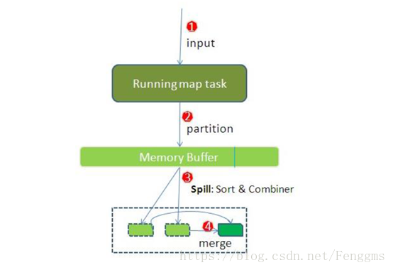
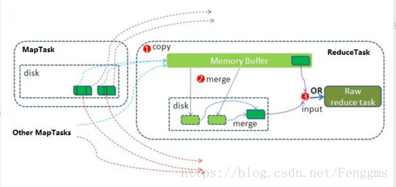
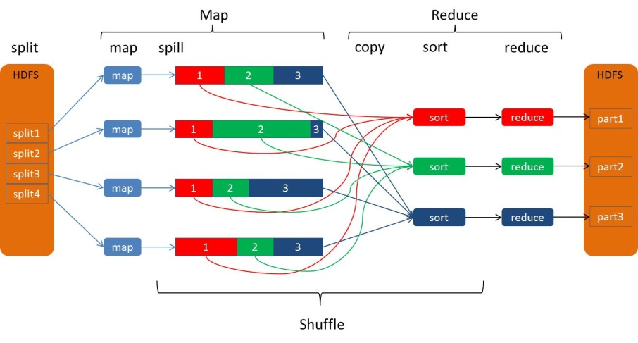
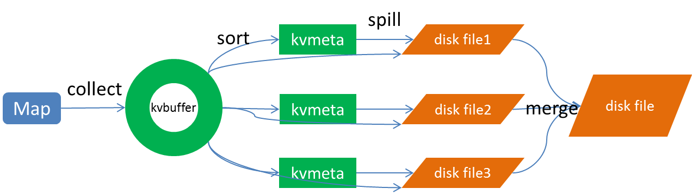
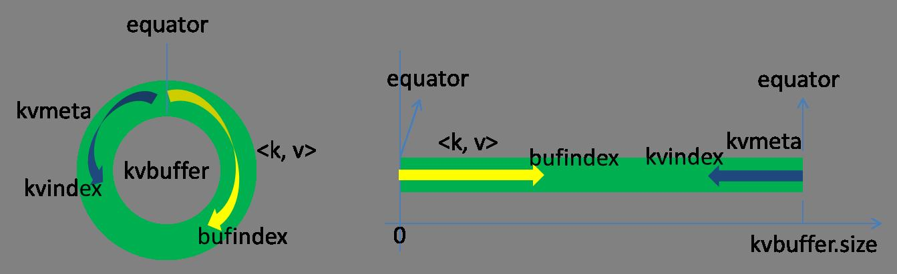
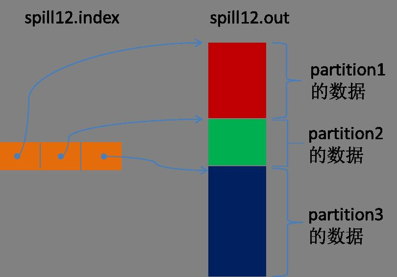
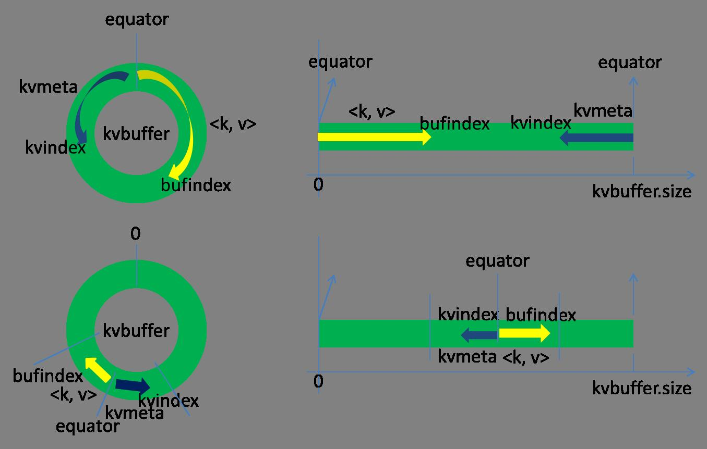
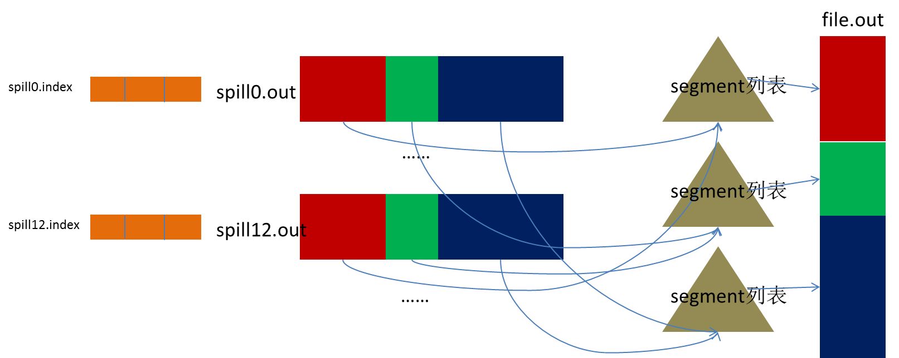

# Hadoop之MapReduce

### MR的介绍

~~~

MapReduce是一种编程模型，用于大规模数据集（大于1TB）的并行运算。 多数学习是对的代码的封装

~~~

### MR的切片 

~~~
hadoop计算的分片大小不小于blockSize，并且不小于mapred.min.split.size。默认情况下，以HDFS的一个块的大小（默认为64M）为一个分片，即分片大小等于分块大小。当某个分块分成均等的若干分片时，会有最后一个分片大小小于定义的分片大小，则该分片独立成为一个分片
max( minimunsize , min( maximusize , blocksize ))
最后一片允许有0.1的冗余
~~~

### MapTask以及ReduceTask

~~~
>> https://blog.csdn.net/Fenggms/article/details/82790006
~~~

#### MapTask运行机制

~~~
简单概述：inputFile通过split被逻辑切分为多个split文件，通过Record按行读取内容给map（用户自己实现的）进行处理，数据被map处理结束之后交给OutputCollector收集器，对其结果key进行分区（默认使用hash分区），然后写入buffer，每个map task都有一个内存缓冲区，存储着map的输出结果，当缓冲区快满的时候需要将缓冲区的数据以一个临时文件的方式存放到磁盘，当整个map task结束后再对磁盘中这个map task产生的所有临时文件做合并，生成最终的正式输出文件，然后等待reduce task来拉数据。
-----------------------------------------------------------------------------------------------------
 简易过程
 ->InputFormat(默认TextIntputFormat)
 ->调用getSplits对输入目录文件进行切片
 ->启动对应Split个数的MapTask
 ->RecordReader(默认LineRecordReader)以\n 作为分隔符读取一行数据,返回<key,value> 偏移量 + 这一行文本内容 
 ->进入定义的Mapper的map方法 
 ->默认使用 HashPartitioner先进行分组处理 然后通过context.write进行数据收集 
 ->数据被写入环形缓冲区 
 ->进行溢出写->按照分区以及key进行排序 
 -->如果存在Combiner先进行合并 
 ->将临时文件写入到磁盘 
-----------------------------------------------------------------------------------------------------

详细步骤：
1、 首先，读取数据组件InputFormat（默认TextInputFormat）会通过getSplits方法对输入目录中文件进行逻辑切片规划得到splits，有多少个split就对应启动多少个MapTask。split与block的对应关系默认是一对一。

2、 将输入文件切分为splits之后，由RecordReader对象（默认LineRecordReader）进行读取，以\n作为分隔符，读取一行数据，返回<key，value>。Key表示每行首字符偏移值，value表示这一行文本内容。

3、 读取split返回<key,value>，进入用户自己继承的Mapper类中，执行用户重写的map函数。RecordReader读取一行这里调用一次。

4、 map逻辑完之后，将map的每条结果通过context.write进行collect数据收集。在collect中，会先对其进行分区处理，默认使用HashPartitioner。
MapReduce提供Partitioner接口，它的作用就是根据key或value及reduce的数量来决定当前的这对输出数据最终应该交由哪个reduce task处理。默认对key hash后再以reduce task数量取模。默认的取模方式只是为了平均reduce的处理能力，如果用户自己对Partitioner有需求，可以订制并设置到job上。

5、接下来，会将数据写入内存，内存中这片区域叫做环形缓冲区，缓冲区的作用是批量收集map结果，减少磁盘IO的影响。我们的key/value对以及Partition的结果都会被写入缓冲区。当然写入之前，key与value值都会被序列化成字节数组。
环形缓冲区其实是一个数组，数组中存放着key、value的序列化数据和key、value的元数据信息，包括partition、key的起始位置、value的起始位置以及value的长度。环形结构是一个抽象概念。
缓冲区是有大小限制，默认是100MB。当map task的输出结果很多时，就可能会撑爆内存，所以需要在一定条件下将缓冲区中的数据临时写入磁盘，然后重新利用这块缓冲区。这个从内存往磁盘写数据的过程被称为Spill，中文可译为溢写。这个溢写是由单独线程来完成，不影响往缓冲区写map结果的线程。溢写线程启动时不应该阻止map的结果输出，所以整个缓冲区有个溢写的比例spill.percent。这个比例默认是0.8，也就是当缓冲区的数据已经达到阈值（buffer size * spill percent = 100MB * 0.8 = 80MB），溢写线程启动，锁定这80MB的内存，执行溢写过程。Map task的输出结果还可以往剩下的20MB内存中写，互不影响。

6、当溢写线程启动后，需要对这80MB空间内的key做排序(Sort)。排序是MapReduce模型默认的行为，这里的排序也是对序列化的字节做的排序。

如果job设置过Combiner，那么现在就是使用Combiner的时候了。将有相同key的key/value对的value加起来，减少溢写到磁盘的数据量。Combiner会优化MapReduce的中间结果，所以它在整个模型中会多次使用。
那哪些场景才能使用Combiner呢？从这里分析，Combiner的输出是Reducer的输入，Combiner绝不能改变最终的计算结果。Combiner只应该用于那种Reduce的输入key/value与输出key/value类型完全一致，且不影响最终结果的场景。比如累加，最大值等。Combiner的使用一定得慎重，如果用好，它对job执行效率有帮助，反之会影响reduce的最终结果。

7、合并溢写文件：每次溢写会在磁盘上生成一个临时文件（写之前判断是否有combiner），如果map的输出结果真的很大，有多次这样的溢写发生，磁盘上相应的就会有多个临时文件存在。当整个数据处理结束之后开始对磁盘中的临时文件进行merge合并，因为最终的文件只有一个，写入磁盘，并且为这个文件提供了一个索引文件，以记录每个reduce对应数据的偏移量。
至此map整个阶段结束。
~~~

##### MapTask的相关配置

~~~
设置环型缓冲区的内存值大小（默认设置如下）
mapreduce.task.io.sort.mb 100

设置溢写百分比（默认设置如下）
mapreduce.map.sort.spill.percent 0.80

设置溢写数据目录（默认设置）
mapreduce.cluster.local.dir ${hadoop.tmp.dir}/mapred/local

设置一次最多合并多少个溢写文件（默认设置如下）
mapreduce.task.io.sort.factor 10
~~~

#### ReduceTask运行机制

~~~
Reduce大致分为copy、sort、reduce三个阶段，重点在前两个阶段。copy阶段包含一个eventFetcher来获取已完成的map列表，由Fetcher线程去copy数据，在此过程中会启动两个merge线程，分别为inMemoryMerger和onDiskMerger，分别将内存中的数据merge到磁盘和将磁盘中的数据进行merge。待数据copy完成之后，copy阶段就完成了，开始进行sort阶段，sort阶段主要是执行finalMerge操作，纯粹的sort阶段，完成之后就是reduce阶段，调用用户定义的reduce函数进行处理。

-----------------------------------------------------------------------------------------------------
简易步骤
-> Reduce进程启动数据copy线程 通过HTTP的方式请求获取maptask属于自己的文件 
-> 对各个Maptask来的数据进行合并 
-> 对合并好的数据进行排序
-> 调用reduce方法 将数据写入到HDFS
-----------------------------------------------------------------------------------------------------

详细步骤：
1、Copy阶段，简单地拉取数据。Reduce进程启动一些数据copy线程(Fetcher)，通过HTTP方式请求maptask获取属于自己的文件。

2、Merge阶段。这里的merge如map端的merge动作，只是数组中存放的是不同map端copy来的数值。Copy过来的数据会先放入内存缓冲区中，这里的缓冲区大小要比map端的更为灵活。merge有三种形式：内存到内存；内存到磁盘；磁盘到磁盘。默认情况下第一种形式不启用。当内存中的数据量到达一定阈值，就启动内存到磁盘的merge。与map 端类似，这也是溢写的过程，这个过程中如果你设置有Combiner，也是会启用的，然后在磁盘中生成了众多的溢写文件。第二种merge方式一直在运行，直到没有map端的数据时才结束，然后启动第三种磁盘到磁盘的merge方式生成最终的文件。

3、合并排序。把分散的数据合并成一个大的数据后，还会再对合并后的数据排序。

4、对排序后的键值对调用reduce方法，键相等的键值对调用一次reduce方法，每次调用会产生零个或者多个键值对，最后把这些输出的键值对写入到HDFS文件中。

~~~

### Shuffle 过程

#### Shuffle介绍

~~~
MapReduce 中 ，mapper阶段处理的数据如何传递给reducer阶段 是MapReduce框架中最关键的流程 ，这个流程就叫Shuffle
具体来说 就是将 MapTask输出的处理结果的数据 ，按照Partitioner组件制定的规则分发给ReduceTask，并在分发的过程中 ，对数据ankey进行了分区和排序 
~~~

#### Shuffle过程图

#### 核心机制

~~~
数据混洗 ------ 核心机制 数据分区 排序 局部聚合 缓存 拉取 在合并 排序
~~~

#### Shuffle过程详解

##### Spill

~~~
Spill过程 包括 输出排序 溢写 合并 等步骤 
~~~

##### Collect

~~~

这个数据结构其实就是个字节数组，叫Kvbuffer，名如其义，但是这里面不光放置了数据，还放置了一些索引数据，给放置索引数据的区域起了一个Kvmeta的别名，在Kvbuffer的一块区域上穿了一个IntBuffer（字节序采用的是平台自身的字节序）的马甲。数据区域和索引数据区域在Kvbuffer中是相邻不重叠的两个区域，用一个分界点来划分两者，分界点不是亘古不变的，而是每次Spill之后都会更新一次。初始的分界点是0，数据的存储方向是向上增长，索引数据的存储方向是向下增长，如图所示
~~~

~~~
Kvbuffer的存放指针bufindex是一直闷着头地向上增长，比如bufindex初始值为0，一个Int型的key写完之后，bufindex增长为4，一个Int型的value写完之后，bufindex增长为8。

索引是对在kvbuffer中的索引，是个四元组，包括：value的起始位置、key的起始位置、partition值、value的长度，占用四个Int长度，Kvmeta的存放指针Kvindex每次都是向下跳四个“格子”，然后再向上一个格子一个格子地填充四元组的数据。比如Kvindex初始位置是-4，当第一个写完之后，(Kvindex+0)的位置存放value的起始位置、(Kvindex+1)的位置存放key的起始位置、(Kvindex+2)的位置存放partition的值、(Kvindex+3)的位置存放value的长度，然后Kvindex跳到-8位置，等第二个和索引写完之后，Kvindex跳到-32位置。

Kvbuffer的大小虽然可以通过参数设置，但是总共就那么大，和索引不断地增加，加着加着，Kvbuffer总有不够用的那天，那怎么办？把数据从内存刷到磁盘上再接着往内存写数据，把Kvbuffer中的数据刷到磁盘上的过程就叫Spill，多么明了的叫法，内存中的数据满了就自动地spill到具有更大空间的磁盘。

关于Spill触发的条件，也就是Kvbuffer用到什么程度开始Spill，还是要讲究一下的。如果把Kvbuffer用得死死得，一点缝都不剩的时候再开始Spill，那Map任务就需要等Spill完成腾出空间之后才能继续写数据；如果Kvbuffer只是满到一定程度，比如80%的时候就开始Spill，那在Spill的同时，Map任务还能继续写数据，如果Spill够快，Map可能都不需要为空闲空间而发愁。两利相衡取其大，一般选择后者。

Spill这个重要的过程是由Spill线程承担，Spill线程从Map任务接到“命令”之后就开始正式干活，干的活叫SortAndSpill，原来不仅仅是Spill，在Spill之前还有个颇具争议性的Sort。
~~~

##### Sort过程

~~~
先把Kvbuffer中的数据按照partition值和key两个关键字升序排序，移动的只是索引数据，排序结果是Kvmeta中数据按照partition为单位聚集在一起，同一partition内的按照key有序。
~~~

##### Spill过程

~~~
Spill线程为这次Spill过程创建一个磁盘文件：从所有的本地目录中轮训查找能存储这么大空间的目录，找到之后在其中创建一个类似于“spill12.out”的文件。Spill线程根据排过序的Kvmeta挨个partition的把数据吐到这个文件中，一个partition对应的数据吐完之后顺序地吐下个partition，直到把所有的partition遍历完。一个partition在文件中对应的数据也叫段(segment)。

所有的partition对应的数据都放在这个文件里，虽然是顺序存放的，但是怎么直接知道某个partition在这个文件中存放的起始位置呢？强大的索引又出场了。有一个三元组记录某个partition对应的数据在这个文件中的索引：起始位置、原始数据长度、压缩之后的数据长度，一个partition对应一个三元组。然后把这些索引信息存放在内存中，如果内存中放不下了，后续的索引信息就需要写到磁盘文件中了：从所有的本地目录中轮训查找能存储这么大空间的目录，找到之后在其中创建一个类似于“spill12.out.index”的文件，文件中不光存储了索引数据，还存储了crc32的校验数据。(spill12.out.index不一定在磁盘上创建，如果内存（默认1M空间）中能放得下就放在内存中，即使在磁盘上创建了，和spill12.out文件也不一定在同一个目录下。)每一次Spill过程就会最少生成一个out文件，有时还会生成index文件，Spill的次数也烙印在文件名中。索引文件和数据文件的对应关系如下图所示：
~~~

~~~
在Spill线程如火如荼的进行SortAndSpill工作的同时，Map任务不会因此而停歇，而是一无既往地进行着数据输出。Map还是把数据写到kvbuffer中，那问题就来了：只顾着闷头按照bufindex指针向上增长，kvmeta只顾着按照Kvindex向下增长，是保持指针起始位置不变继续跑呢，还是另谋它路？如果保持指针起始位置不变，很快bufindex和Kvindex就碰头了，碰头之后再重新开始或者移动内存都比较麻烦，不可取。

Map取kvbuffer中剩余空间的中间位置，用这个位置设置为新的分界点，bufindex指针移动到这个分界点，Kvindex移动到这个分界点的-16位置，然后两者就可以和谐地按照自己既定的轨迹放置数据了，当Spill完成，空间腾出之后，不需要做任何改动继续前进。分界点的转换如下图所示：
~~~

##### Merge过程

~~~
Map任务如果输出数据量很大，可能会进行好几次Spill，out文件和Index文件会产生很多，分布在不同的磁盘上。最后把这些文件进行合并的merge过程闪亮登场。

Merge过程怎么知道产生的Spill文件都在哪了呢？从所有的本地目录上扫描得到产生的Spill文件，然后把路径存储在一个数组里。Merge过程又怎么知道Spill的索引信息呢？没错，也是从所有的本地目录上扫描得到Index文件，然后把索引信息存储在一个列表里。到这里，又遇到了一个值得纳闷的地方。在之前Spill过程中的时候为什么不直接把这些信息存储在内存中呢，何必又多了这步扫描的操作？特别是Spill的索引数据，之前当内存超限之后就把数据写到磁盘，现在又要从磁盘把这些数据读出来，还是需要装到更多的内存中。之所以多此一举，是因为这时kvbuffer这个内存大户已经不再使用可以回收，有内存空间来装这些数据了。（对于内存空间较大的土豪来说，用内存来省却这两个io步骤还是值得考虑的。）

然后为merge过程创建一个叫file.out的文件和一个叫file.out.Index的文件用来存储最终的输出和索引。

一个partition一个partition的进行合并输出。对于某个partition来说，从索引列表中查询这个partition对应的所有索引信息，每个对应一个段插入到段列表中。也就是这个partition对应一个段列表，记录所有的Spill文件中对应的这个partition那段数据的文件名、起始位置、长度等等。

然后对这个partition对应的所有的segment进行合并，目标是合并成一个segment。当这个partition对应很多个segment时，会分批地进行合并：先从segment列表中把第一批取出来，以key为关键字放置成最小堆，然后从最小堆中每次取出最小的输出到一个临时文件中，这样就把这一批段合并成一个临时的段，把它加回到segment列表中；再从segment列表中把第二批取出来合并输出到一个临时segment，把其加入到列表中；这样往复执行，直到剩下的段是一批，输出到最终的文件中。
最终的索引数据仍然输出到Index文件中。
~~~

~~~
Map端的Shuffle过程到此结束。
~~~

##### Copy

~~~
Reduce任务通过HTTP向各个Map任务拖取它所需要的数据。每个节点都会启动一个常驻的HTTP server，其中一项服务就是响应Reduce拖取Map数据。当有MapOutput的HTTP请求过来的时候，HTTP server就读取相应的Map输出文件中对应这个Reduce部分的数据通过网络流输出给Reduce。

Reduce任务拖取某个Map对应的数据，如果在内存中能放得下这次数据的话就直接把数据写到内存中。Reduce要向每个Map去拖取数据，在内存中每个Map对应一块数据，当内存中存储的Map数据占用空间达到一定程度的时候，开始启动内存中merge，把内存中的数据merge输出到磁盘上一个文件中。

如果在内存中不能放得下这个Map的数据的话，直接把Map数据写到磁盘上，在本地目录创建一个文件，从HTTP流中读取数据然后写到磁盘，使用的缓存区大小是64K。拖一个Map数据过来就会创建一个文件，当文件数量达到一定阈值时，开始启动磁盘文件merge，把这些文件合并输出到一个文件。

有些Map的数据较小是可以放在内存中的，有些Map的数据较大需要放在磁盘上，这样最后Reduce任务拖过来的数据有些放在内存中了有些放在磁盘上，最后会对这些来一个全局合并。
~~~

##### MergeSort

~~~
这里使用的Merge和Map端使用的Merge过程一样。Map的输出数据已经是有序的，Merge进行一次合并排序，所谓Reduce端的sort过程就是这个合并的过程。一般Reduce是一边copy一边sort，即copy和sort两个阶段是重叠而不是完全分开的。

Reduce端的Shuffle过程至此结束。
~~~

### MR的调优

~~~
1. mapreduce.task.io.sort.factor: mr程序进行合并排序的时候，打开的文件数量，默认为10个.
2. mapreduce.task.io.sort.mb: mr程序进行合并排序操作的时候或者mapper写数据的时候，内存大小，默认100M
3. mapreduce.map.sort.spill.percent： mr程序进行flush操作的阀值，默认0.80。
4. mapreduce.reduce.shuffle.parallelcopies：mr程序reducer copy数据的线程数，默认5。
5. mapreduce.reduce.shuffle.input.buffer.percent: reduce复制map数据的时候指定的内存堆大小百分比，默认为0.70，适当的增加该值可以减少map数据的磁盘溢出，能够提高系统性能。
6. mapreduce.reduce.shuffle.merge.percent：reduce进行shuffle的时候，用于启动合并输出和磁盘溢写的过程的阀值，默认为0.66。如果允许，适当增大其比例能够减少磁盘溢写次数，提高系统性能。同mapreduce.reduce.shuffle.input.buffer.percent一起使用。
7. mapreduce.task.timeout：mr程序的task执行情况汇报过期时间，默认600000(10分钟)，设置为0表示不进行该值的判断。
~~~

### MR的uber模式 

#### uber的原理 

~~~
小作业的ubser模式 
允许小作业按序列在单个JVM中运行 （减少频繁启动时间） 多个作业运行在同一个容器
Uber运行模式对小作业进行优化，不会给每个任务分别申请分配Container资源，这些小任务将统一在一个Container中按照先执行map任务后执行reduce任务的顺序串行执行。那么什么样的任务，mapreduce框架会认为它是小任务呢？

map任务的数量不大于mapreduce.job.ubertask.maxmaps参数（默认值是9）的值;
reduce任务的数量不大于mapreduce.job.ubertask.maxreduces参数（默认值是1）的值;
输入文件大小不大于mapreduce.job.ubertask.maxbytes参数（默认为1个Block的字节大小）的值；
map任务和reduce任务需要的资源量不能大于MRAppMaster（mapreduce作业的ApplicationMaster）
可用的资源总量；也就是说yarn.app.mapreduce.am.resource.mb必须大于mapreduce.map.memory.mb和mapreduce.reduce.memory.mb以及yarn.app
.mapreduce.am.resource.cpu-vcores必须大于mapreduce.map.cpu.vcores和
mapreduce.reduce.cpu.vcores以启用ubertask。
-----------------------------------------------------------------------------------------------------
tips:
保证map需要的内存 + reduce需要的内存 <= MapReduceMaster 的可用内存总量
保证reduce需要的核心 + reduce需要的核心 <= MapReduceMaster 的可用核心数目总量 
-----------------------------------------------------------------------------------------------------

参数mapreduce.job.ubertask.enable用来控制是否开启Uber运行模式，默认为false。
**优化：该优化在单个JVM中按顺序运行“足够小”的作业。

~~~

#### uber的配置

~~~xml
mapred-site.xml
<property>
<!--开启ubertask模式-->
<name>mapreduce.job.ubertask.enable</name>
<value>true</value>
</property>
//最大maptask的数量
<property>
<name>mapreduce.job.ubertask.maxmaps</name>
<value>9</value>
</property>
//最大reducestask的数量
<property>
<name>mapreduce.job.ubertask.maxreduces</name>
<value>1</value>
</property>
//小作业模式 最大字节数
<property>
<name>mapreduce.job.ubertask.maxbytes</name>
<value>102400000</Mvalue>
</property>
~~~

### MR本地跑 

~~~

~~~

### MR相关代码 

#### WordCount

~~~java
package MapReduce;

import java.io.IOException;
import org.apache.hadoop.conf.Configuration;
import org.apache.hadoop.fs.Path;
import org.apache.hadoop.io.IntWritable;
import org.apache.hadoop.io.LongWritable;
import org.apache.hadoop.io.Text;
import org.apache.hadoop.mapreduce.Job;
import org.apache.hadoop.mapreduce.Mapper;
import org.apache.hadoop.mapreduce.Reducer;
import org.apache.hadoop.mapreduce.lib.input.FileInputFormat;
import org.apache.hadoop.mapreduce.lib.output.FileOutputFormat;

/*wordcount 词频统计
 * 文件名 ： words
 * 内容： 
 * hello yuniko hello world
 * hi yuniko hi world
 * best best best
 * 
 * map
 *     Mapper<KEYIN, VALUEIN, KEYOUT, VALUEOUT> 
 *  KEYIN		表示行的偏移量
 * VALUEIN		表示行文本内容
 *   KEYOUT		表示行中出现的单词
 * VALUEOUT		表示行中出现的单词的次数，固定值1

 *   map阶段的输入：
 * 0 hello yuniko hello world
 * 28 hi yuniko hi world
 * 48 best best best
 *   map阶段的输出：
 *   
 * reduce 
 *    reduce的输入：
 *     Reducer<KEYIN, VALUEIN, KEYOUT, VALUEOUT> 
 *     KEYIN		表示行中出现的单词
 *     VALUEIN		表示行中出现的单词的次数
 *     KEYOUT		表示文本中出现的不同单词
 *     VALUEOUT		表示文本中出现的不同单词的总次数
 *     reduce的输入 KEYIN, VALUEIN 必须和map阶段的输入相同
 *     reduce的输出 KEYOUT, VALUEOUT 最后的输出值和类型
 *     Reducer<Text,IntWritable,Text,IntWritable>
 *     第一个保证和map阶段keyout一致
 *     第二个保证和map阶段valueout一致
 *    reduce的输出
 * 
 *    Tips:(选中一行变大写 ctrl + shift +y)
 *      (选中一行变大写 ctrl + shift +x)
 *    整型（int） 对应的writable封装     IntWritable
 * 
 * */
public class MyWordCount {
public static class MyMapper extends Mapper<LongWritable, Text, Text, IntWritable>{
 public static Text k = new Text();
 public static IntWritable v = new IntWritable();
 		@Override
	protected void map(LongWritable key, Text value,Context context)
			throws IOException, InterruptedException {
		// TODO Auto-generated method stub
		/*1.从输入数据中每一个文件中的每一行的值*/
		String line =value.toString();
		/*2.对每一行的数据进行切分（有的不用）*/
		String[] words = line.split(" ");
		/*3.循环处理*/
		for(String word: words)
		{
			k.set(word);
			v.set(1);
			//map阶段的输出    
		}	context.write(k, v);
	}
	   /*Tips：右击->源->实现方法*/
}
public static class MyReducer extends Reducer<Text,IntWritable,Text,IntWritable>{

	@Override
	protected void reduce(Text key, Iterable<IntWritable> values,
			Context context) throws IOException, InterruptedException {
		/*实际输入值
		eg： best 1,1,1*/
	   //自定义一个计数器
		int count =0;
		//循环迭代器中的值
		for(IntWritable i: values)
		{
			count +=i.get();
		}
	     //reduce阶段的最终输出
		context.write(key,new IntWritable(count));
		
	}
}
public static void main(String[] args) throws IOException, ClassNotFoundException, InterruptedException {
	//1.获取配置对象信息
	   Configuration configuration = new Configuration();
	   //2.conf设置（没有就不用）
	   //3.获取job对象
	   Job job = Job.getInstance(configuration, "mywordcount");

	   //4.设置job的运行主类
	   job.setJarByClass(MyWordCount.class);
	   //5.对map阶段进行设置
	   job.setMapperClass(MyMapper.class);
	   job.setMapOutputKeyClass(Text.class);
	   job.setMapOutputValueClass(IntWritable.class);
	   FileInputFormat.addInputPath(job, new Path(args[0]));
	   //6.对reduce阶段设置
	   job.setReducerClass(MyReducer.class);
	   job.setOutputKeyClass(Text.class);
	   job.setOutputValueClass(IntWritable.class);
	   FileOutputFormat.setOutputPath(job, new Path(args[1]));
	   
	   //8.提交作业并打印信息
	  int isOK =  job.waitForCompletion(true)? 0 : 1 ;
	  //8.退出job
	  System.exit(isOK);
	  System.out.println("job结束");
   
}
}

~~~

#### 分区器的使用 Partitioner

~~~java
package test;
import org.apache.hadoop.conf.Configuration;
import org.apache.hadoop.fs.Path;
import org.apache.hadoop.io.LongWritable;
import org.apache.hadoop.io.Text;
import org.apache.hadoop.mapreduce.Job;
import org.apache.hadoop.mapreduce.Mapper;
import org.apache.hadoop.mapreduce.Partitioner;
import org.apache.hadoop.mapreduce.Reducer;
import org.apache.hadoop.mapreduce.lib.input.FileInputFormat;
import org.apache.hadoop.mapreduce.lib.output.FileOutputFormat;

import java.io.IOException;

public class Test6 {

 public static class Test6Mapper extends Mapper<LongWritable, Text,Text,Text> {
     @Override
     protected void map(LongWritable key, Text value, Context context) throws IOException, InterruptedException {
              String line = value.toString();
              String[] str= line.split(" ");
              for(String st :str)
              {
                  context.write(new Text(st),new Text("1"));
              }
     }
 }
 public static class Test6Reduce extends Reducer<Text,Text, Text,Text> {
     int n =0;
     @Override
     protected void reduce(Text key, Iterable<Text> values, Context context) throws IOException, InterruptedException {
         n=0;
         for(Text t:values)
         {
             n++;}
         context.write(key,new Text(String.valueOf(n)));
     }
 }

 public static void main(String[] args) throws IOException, ClassNotFoundException, InterruptedException {
     Configuration conf = new Configuration();
     Job job = Job.getInstance(conf,"test5");
     job.setJarByClass(Test6.class);
     job.setMapOutputKeyClass(Text.class);
     job.setMapOutputValueClass(Text.class);
     job.setMapperClass(Test6Mapper.class);
     job.setReducerClass(Test6Reduce.class);
     job.setOutputValueClass(Text.class);
     job.setOutputKeyClass(Text.class);
     //设置分区任务
     job.setPartitionerClass(ZdiPartitioner.class);
     job.setNumReduceTasks(2);

     FileInputFormat.setInputPaths(job,new Path("src/lyc.txt"));
     FileOutputFormat.setOutputPath(job,new Path("src/output/06"));
     int a =job.waitForCompletion(true)? 1:0;
     if(a==1)
     {
         System.out.println("成功");
     }else{
         System.out.println("失败");
     }
 }

}
class ZdiPartitioner extends Partitioner<Text,Text>{
 // 返回值必须从0开始 一步一步增加
 @Override
 public int getPartition(Text text, Text text2, int i) {
     String dname = text.toString();
     char a = dname.charAt(0);
     if(a<'j'){
         return  1;
     }
     else {
         return  0;
     }
 }
}

~~~

#### 组合器 Combiner

~~~java

//组合器适用于key值重复率过高的情况 减少网络传输的压力 
package test;

import org.apache.hadoop.conf.Configuration;
import org.apache.hadoop.fs.Path;
import org.apache.hadoop.io.LongWritable;
import org.apache.hadoop.io.Text;
import org.apache.hadoop.mapreduce.Job;
import org.apache.hadoop.mapreduce.Mapper;
import org.apache.hadoop.mapreduce.Reducer;

import org.apache.hadoop.mapreduce.lib.input.FileInputFormat;
import org.apache.hadoop.mapreduce.lib.input.FileSplit;
import org.apache.hadoop.mapreduce.lib.output.FileOutputFormat;

import java.io.IOException;
import java.util.Iterator;
import java.util.TreeSet;

public class Test7 {

 // 倒排索引
 /*
 *
    * index1.html
    * hadoop hadoop scala spark storm
    * index2.html
    * hadoop scala scala
 *
    * hadoop_index1.html,1
    * hadoop_index2.html ,1
 *
    * -----------------------------------------
    * hadoop: index1.html 2;index2.html 1
    * scala: index2.html 2;index1.html 2
    * spark: index1.html 1;index1.html 1
    * ---
 *
 *
 *
    * (hadoop|index.html,1)(scala|index.html,1)(hadoop|index.html ,1)(scala|index.html,1)
    * (hadoop|index.html,list(1,1))
    * (scala|index.html,list(1,1))
 *
    * */
 public static class Test7Mapper extends Mapper<LongWritable,Text,Text, Text>{
     @Override
     protected void map(LongWritable key, Text value, Context context) throws IOException, InterruptedException {

        String name =  ((FileSplit)context.getInputSplit()).getPath().getName();

         String[] str= value.toString().split(" ");

          for(int i=0;i<=str.length-1;i++)
         {
             context.write(new Text(str[i]+"|"+name),new Text("1"));
         }
     //hadoop|index.txt 1

     }
 }
 public static class Test7Reduce extends Reducer<Text,Text,Text,Text>{
     @Override
     protected void reduce(Text key, Iterable<Text> values, Context context) throws IOException, InterruptedException {

         TreeSet<bijiao> treeSet = new TreeSet<>();
         String str = "";
         for(Text text:values)
         {
             String[] splits = text.toString().split(":");
             treeSet.add(new bijiao(Integer.parseInt(splits[1]),splits[0]));
         }
        Iterator<bijiao> iterator = treeSet.iterator();
         while(iterator.hasNext())
         {
             bijiao  b = iterator.next();
             str = str+b.toString()+";";
         }
         context.write(key,new Text(str));
         context.write(new Text("------"),new Text("------"));
     }
 }

 public static void main(String[] args) throws IOException, ClassNotFoundException, InterruptedException {
     Configuration conf = new Configuration();

     Job job = Job.getInstance(conf,"test7");
     job.setJarByClass(Test7.class);
     job.setMapOutputKeyClass(Text.class);
     job.setMapOutputValueClass(Text.class);
     job.setMapperClass(Test7.Test7Mapper.class);
     job.setReducerClass(Test7.Test7Reduce.class);
     job.setCombinerClass(Mycomb.class);
     job.setOutputValueClass(Text.class);
     job.setOutputKeyClass(Text.class);
     FileInputFormat.addInputPath(job,new Path("src/index1.txt"));
     FileInputFormat.addInputPath(job,new Path("src/index2.txt"));
     FileOutputFormat.setOutputPath(job,new Path("src/output/07"));
     int a =job.waitForCompletion(true)? 1:0;
     if(a==1)
     {
         System.out.println("成功");
     }else{
         System.out.println("失败");
     }
 }

}
class Mycomb extends Reducer<Text,Text,Text,Text>
{
 @Override
 protected void reduce(Text key, Iterable<Text> values, Context context) throws IOException, InterruptedException {
     String line  = key.toString();
     String[] str = line.split("\\|");
     int sum =0;
     for(Text t :values)
     {
         sum++;
     }
     context.write(new Text(str[0]),new Text(str[1]+":"+String.valueOf(sum)));
 }
}
class bijiao implements Comparable<bijiao> {
 public int a;
 public String b;

 public bijiao(int a, String b) {
     this.a = a;
     this.b = b;
 }

 @Override
 public int compareTo(bijiao o) {
     return o.a==this.a ? o.b.hashCode()-this.b.hashCode() : o.a-this.a;

 }

 @Override
 public String toString() {
     return "bijiao{" +
             "a=" + a +
             ", b='" + b + '\'' +
             '}';
 }
}
~~~

#### Top-N

~~~java
package test;

import org.apache.hadoop.conf.Configuration;
import org.apache.hadoop.fs.Path;
import org.apache.hadoop.io.LongWritable;
import org.apache.hadoop.io.Text;
import org.apache.hadoop.mapreduce.Job;
import org.apache.hadoop.mapreduce.Mapper;
import org.apache.hadoop.mapreduce.Reducer;
import org.apache.hadoop.mapreduce.lib.input.FileInputFormat;
import org.apache.hadoop.mapreduce.lib.output.FileOutputFormat;
import java.io.IOException;
import java.util.Iterator;
import java.util.TreeSet;

public class Test9 {

 // Top-N
 /*
     * 数据为lrc文件

     * ---
     * */
 public static class Test9Mapper extends Mapper<LongWritable,Text,Text, Text>{
     @Override
     protected void map(LongWritable key, Text value, Context context) throws IOException, InterruptedException {
         String line =value.toString();
         String[] str = line.split(" +");
         for(String st :str){
             context.write(new Text(st),new Text("1"));
         }

     }
 }
    /**
    如果为了省事可以不用一直维护3的TreeSet  可以在Reducer的生命周期方法中最后在将前N名
    写入.
    */
 public static class Test9Reduce extends Reducer<Text,Text,Text,Text>{
     TreeSet<WC> treeSet = new TreeSet<>();

     @Override
     protected void reduce(Text key, Iterable<Text> values, Context context) throws IOException, InterruptedException {
      int sum=0;
       for(Text t:values){
           sum++;
       }
       if(treeSet.size()<3){
           treeSet.add(new WC(sum,key.toString()));
       }else{
           if(treeSet.last().sum<sum){
               treeSet.add(new WC(sum,key.toString()));
               //移除最小的一个
               treeSet.remove(treeSet.last());
           }
       }

     }

     @Override
     protected void cleanup(Context context) throws IOException, InterruptedException {
         Iterator<WC> iterator = treeSet.iterator();
         while(iterator.hasNext()){
             WC wc = iterator.next();
             context.write(new Text(wc.name),new Text(String.valueOf(wc.sum)));
         }

     }
 }

 public static void main(String[] args) throws IOException, ClassNotFoundException, InterruptedException {
     Configuration conf = new Configuration();

     Job job = Job.getInstance(conf,"test5");
     job.setJarByClass(Test9.class);
     job.setMapOutputKeyClass(Text.class);
     job.setMapOutputValueClass(Text.class);
     job.setMapperClass(Test9.Test9Mapper.class);
     job.setReducerClass(Test9.Test9Reduce.class);
     job.setOutputValueClass(Text.class);
     job.setOutputKeyClass(Text.class);
     FileInputFormat.setInputPaths(job,new Path("src/lyc.txt"));
     FileOutputFormat.setOutputPath(job,new Path("src/output/09"));
     int a =job.waitForCompletion(true)? 1:0;
     if(a==1)
     {
         System.out.println("成功");
     }else{
         System.out.println("失败");
     }
 }

}
class WC implements Comparable<WC> {

 int sum ;
 String name;
 public WC(int sum,String name){

     this.sum = sum;
     this.name= name;

 }

 @Override
 public int compareTo(WC o) {
     return o.sum==this.sum ? 0:o.sum-this.sum;

 }
}
~~~

#### 二次排序

~~~java
package test;

     import org.apache.hadoop.conf.Configuration;
     import org.apache.hadoop.fs.Path;
     import org.apache.hadoop.io.LongWritable;
     import org.apache.hadoop.io.Text;
     import org.apache.hadoop.io.WritableComparable;
     import org.apache.hadoop.io.WritableComparator;
     import org.apache.hadoop.mapreduce.Job;
     import org.apache.hadoop.mapreduce.Mapper;
     import org.apache.hadoop.mapreduce.Reducer;
     import org.apache.hadoop.mapreduce.lib.input.FileInputFormat;
     import org.apache.hadoop.mapreduce.lib.output.FileOutputFormat;

     import java.io.DataInput;
     import java.io.DataOutput;
     import java.io.IOException;

public class Test10 {
 /*
wordcount 二次排序
*/

 public static class Test10Mapper extends Mapper<LongWritable, Text,ECPX, Text> {
     @Override
     protected void map(LongWritable key, Text value, Context context) throws IOException, InterruptedException {

         String[] str = value.toString().split(" ");

         context.write(new ECPX(str[0],Integer.parseInt(str[1])),new Text(""));

     }
 }
 public static class Test10Reduce extends Reducer<ECPX,Text,Text,Text> {
     @Override
     protected void reduce(ECPX key, Iterable<Text> values, Context context) throws IOException, InterruptedException {

         context.write(new Text(key.toString()),new Text(""));

     }
 }

 public static void main(String[] args) throws IOException, ClassNotFoundException, InterruptedException {
     Configuration conf = new Configuration();

     Job job = Job.getInstance(conf,"test10");
     job.setJarByClass(Test10.class);
     job.setMapOutputKeyClass(ECPX.class);
     job.setMapOutputValueClass(Text.class);
     job.setMapperClass(Test10.Test10Mapper.class);
     job.setReducerClass(Test10.Test10Reduce.class);
     job.setOutputValueClass(Text.class);
     job.setOutputKeyClass(Text.class);
     FileInputFormat.setInputPaths(job,new Path("src/ecpx.txt"));
     FileOutputFormat.setOutputPath(job,new Path("src/output/10"));
     int a =job.waitForCompletion(true)? 1:0;
     if(a==1)
     {
         System.out.println("成功");
     }else{
         System.out.println("失败");
     }
 }

}
class  ECPX implements  WritableComparable<ECPX>{
 public ECPX(){}
 //必须使用 无参构造函数

 String name;
 int i;
 public ECPX(String name,int i){
     super();
     this.name=name;
     this.i =i;
 }

 @Override
 public int compareTo(ECPX o) {

     return o.i==this.i? o.name.hashCode()-this.name.hashCode():o.i-this.i;
 }

 @Override
 public void write(DataOutput out) throws IOException {
     out.writeUTF(name);
     out.writeInt(i);
 }

 @Override
 public void readFields(DataInput in) throws IOException {
     this.name = in.readUTF();
     this.i  =in.readInt();

 }

 @Override
 public String toString() {
     return "ECPX{" +
             "name='" + name + '\'' +
             ", i=" + i +
             '}';
 }
}
~~~

#### 二次排序与作业依赖 

~~~java

package test;

import org.apache.hadoop.conf.Configuration;
import org.apache.hadoop.fs.Path;
import org.apache.hadoop.io.LongWritable;
import org.apache.hadoop.io.NullWritable;
import org.apache.hadoop.io.Text;

import org.apache.hadoop.io.WritableComparable;
import org.apache.hadoop.mapred.JobConf;
import org.apache.hadoop.mapreduce.Job;
import org.apache.hadoop.mapreduce.Mapper;
import org.apache.hadoop.mapreduce.Reducer;
import org.apache.hadoop.mapreduce.lib.input.FileInputFormat;
import org.apache.hadoop.mapreduce.lib.jobcontrol.ControlledJob;
import org.apache.hadoop.mapreduce.lib.jobcontrol.JobControl;
import org.apache.hadoop.mapreduce.lib.output.FileOutputFormat;

import java.io.DataInput;
import java.io.DataOutput;
import java.io.IOException;

public class Test13 {

 // MR多作业依赖问题 一个作业依赖于另一个作业问题
  public static class Test13_1Mapper extends Mapper<LongWritable, Text,Text,Text>{
     @Override
     protected void map(LongWritable key, Text value, Context context) throws IOException, InterruptedException {
         String[]  str = value.toString().split(" ");
         for(String s :str)
         context.write(new Text(s),new Text("1"));

     }
 }
  public static class Test13_1Reduce extends Reducer<Text,Text,Text,Text>{
      @Override
      protected void reduce(Text key, Iterable<Text> values, Context context) throws IOException, InterruptedException {
          int sum = 0;
          for(Text t:values){
              sum++;
          }
          context.write(key,new Text(String.valueOf(sum)));
      }
  }
  public static class Test13_2Mapper extends Mapper<LongWritable,Text,zidingyi, NullWritable>{

      @Override
      protected void map(LongWritable key, Text value, Context context) throws IOException, InterruptedException {
          String[] str = value.toString().split("\t");

          System.out.println("+++++++++++++++++"+context);
           context.write(new zidingyi(str[0],Integer.parseInt(str[1])), NullWritable.get());

      }
  }
  public static class Test13_2Reduce extends Reducer<zidingyi, NullWritable,Text,Text>{
      @Override
      protected void reduce(zidingyi key, Iterable<NullWritable> values, Context context) throws IOException, InterruptedException {
          context.write(new Text(key.toString()),new Text(""));
      }
  }

 public static void main(String[] args) throws IOException, ClassNotFoundException, InterruptedException {
     
    Configuration conf1 = new Configuration();
     Job job1 = Job.getInstance(conf1,"job1");
     job1.setJarByClass(Test13.class);
     job1.setMapperClass(Test13_1Mapper.class);
     job1.setMapOutputValueClass(Text.class);
     job1.setMapOutputKeyClass(Text.class);

     job1.setReducerClass(Test13_1Reduce.class);
     job1.setOutputKeyClass(Text.class);
     job1.setOutputValueClass(Text.class);
     FileInputFormat.addInputPath(job1, new Path("src/lyc.txt"));
     FileOutputFormat.setOutputPath(job1, new Path("src/output/13/13_1"));
     
     ControlledJob controlledJob1 = new ControlledJob(job1.getConfiguration());
     controlledJob1.setJob(job1);
     Configuration conf2 = new Configuration();
     Job job2 = Job.getInstance(conf2,"job2");
     job2.setJarByClass(Test13.class);
     job2.setMapperClass(Test13_2Mapper.class);
     job2.setMapOutputValueClass(NullWritable.class);
     job2.setMapOutputKeyClass(zidingyi.class);
     job2.setReducerClass(Test13_2Reduce.class);
     job2.setOutputKeyClass(Text.class);
     job2.setOutputValueClass(Text.class);

     ControlledJob controlledJob2 = new ControlledJob(job2.getConfiguration());
     controlledJob2.setJob(job2);
         // 添加作业依赖
     controlledJob2.addDependingJob(controlledJob1);
     FileInputFormat.addInputPath(job2, new Path("src/output/13/13_1"));
     FileOutputFormat.setOutputPath(job2, new Path("src/output/13/13_2"));
     JobControl jobControl = new JobControl("yilaiControl");
     jobControl.addJob(controlledJob1);
     jobControl.addJob(controlledJob2);
     new Thread(jobControl).start();    //开启控制线程
     while (true) {
         if (jobControl.allFinished()) {
             System.out.println("作业全部完成");
             System.out.println(jobControl.getSuccessfulJobList());
             break;
         }
     }
    }

}
class zidingyi implements WritableComparable<zidingyi> {
 public  zidingyi(){

 }
 public String name;
 public int n;

 public zidingyi(String name, int n) {
     
     this.name = name;
     this.n = n;
 }

 @Override
 public int compareTo(zidingyi o) {
     return o.n-this.n;
 }

 @Override
 public void write(DataOutput out) throws IOException {
  out.writeUTF(name);
  out.writeInt(n);

 }

 @Override
 public void readFields(DataInput in) throws IOException {
     this.name = in.readUTF();
     this.n = in.readInt();
 }

 @Override
 public String toString() {
     return "zidingyi{" +
             "name='" + name + '\'' +
             ", n=" + n +
             '}';
 }
}

~~~

#### mapJoin

~~~java
package test;
/*
@author Yuniko
2019/9/4
reduce端join:
核心思想：在map端将来源于不同的数据或者是有不同用处的数据打上标签，以便在reduce端接收并连接查找关系。
使用场景：无论大表小表(无论文件的大小)。
优点：解决的业务范围广。
缺点：map端到reduce的传输量比较大(且大量为无效数据)，经历shuffle更加耗时；reduce端的join效率低下。
16_log.txt
1 1 2019-1-10
2 1 2019-1-10
3 2 2019-1-10
4 2 2019-1-10
5 1 2019-1-10
6 3 2019-1-10
7 1 2019-1-10
8 2 2019-1-10
9 2 2019-1-10
16_sex.txt
1 男
2 女
3 无
16_data.txt
1 姓名1 地址1
2 姓名2 地址2
3 姓名3 地址3
4 姓名4 地址4
5 姓名5 地址5
6 姓名6 地址6
7 姓名7 地址7
8 姓名8 地址8
9 姓名9 地址9
10 姓名10 地址10

*/

import org.apache.hadoop.conf.Configuration;
import org.apache.hadoop.fs.Path;
import org.apache.hadoop.io.LongWritable;
import org.apache.hadoop.io.Text;
import org.apache.hadoop.mapreduce.InputSplit;
import org.apache.hadoop.mapreduce.Job;
import org.apache.hadoop.mapreduce.Mapper;
import org.apache.hadoop.mapreduce.Reducer;

import org.apache.hadoop.mapreduce.filecache.DistributedCache;
import org.apache.hadoop.mapreduce.lib.input.FileInputFormat;
import org.apache.hadoop.mapreduce.lib.input.FileSplit;
import org.apache.hadoop.mapreduce.lib.output.FileOutputFormat;

import java.io.BufferedReader;
import java.io.FileReader;
import java.io.IOException;
import java.net.URI;
import java.net.URISyntaxException;
import java.util.HashMap;
import java.util.Map;
/*
@author Yuniko
2019/9/4

map-side join:(最为高效)
核心思想：将小表进行分布式缓存，在map-task阶段读取缓存文件数据存储到内存数据结构中，
以供后续阶段连接查找。
适用场景：有一个或者多个小表(文件)
优点：将小表缓存，可以高效查询；由于在map阶段进行连接，所以将会大大减小map到reduce端
的数据传输，从而减少不必要的shuffle耗时，提高整个mr的执行效率
缺点：如果业务全是大表不适合

*/

public class Test16 {

 static int n=0;
 public static class Test16Mapper extends Mapper<LongWritable,Text,Text,Text> {

     Map<String,String>  sexMap = new HashMap<>();
     Map<String,String>  dataMap = new HashMap<>();

     @Override
     protected void setup(Context context) throws IOException, InterruptedException {
      /*   DistributedCache.getLocalCacheFiles(context.getConfiguration());*/
         //获取缓存的小表
         Path[] localCacheFiles = context.getLocalCacheFiles();
         BufferedReader reader = null;

         for(Path p : localCacheFiles)
         {
          if(p.getName().equals("16_sex.txt"))
          {
             reader = new BufferedReader(new FileReader("src/"+p.getName()));

             while(reader.ready()) {

                 String[] str  = reader.readLine().split(" ");
                 sexMap.put(str[0],str[1]);
             }

         }
         else if (p.getName().equals("16_data.txt")){
        reader = new BufferedReader(new FileReader("src/"+p.getName()));
        while(reader.ready()){
            String[] str =reader.readLine().split(" ");
              dataMap.put(str[0],str[1]+str[2]);
        }
       }
      }

     }

     @Override
     protected void map(LongWritable key, Text value, Context context) throws IOException, InterruptedException {
              String line = value.toString();
              String[] str = line.split(" ");
              String sex = sexMap.get(str[1]);
              String data = dataMap.get(str[0]);
              context.write(new Text(str[0]),new Text(sex +data +str[2]));

     }
 }
 public static class Test16Reduce extends Reducer<Text,Text, Text,Text>{

     @Override
     protected void reduce(Text key, Iterable<Text> values, Context context) throws IOException, InterruptedException {

         for(Text t : values){
             context.write(key,t);
         }
     }
 }

 public static void main(String[] args) throws IOException, ClassNotFoundException, InterruptedException, URISyntaxException {
     Configuration conf = new Configuration();

     Job job = Job.getInstance(conf,"test5");
     job.setJarByClass(Test16.class);
     job.setMapOutputKeyClass(Text.class);
     job.setMapOutputValueClass(Text.class);
     job.setMapperClass(Test16Mapper.class);

     // job.setCombinerClass(Comb12.class);
     job.setReducerClass(Test16Reduce.class);
     job.setOutputValueClass(Text.class);
     // 设置缓存的小表 
     job.addCacheFile(new URI("src/16_sex.txt"));
     job.addCacheFile(new URI("src/16_data.txt"));
     job.setOutputKeyClass(Text.class);
     FileInputFormat.setInputPaths(job,new Path("src/16_log.txt"));
     FileOutputFormat.setOutputPath(job,new Path("src/output/16"));
     int a =job.waitForCompletion(true)? 1:0;
     if(a==1)
     {
         System.out.println("成功");
     }else{
         System.out.println("失败");
     }
 }
}

~~~

#### Reducejoin

~~~java
package test;/*
@author Yuniko
2019/9/4

*reduce-side join:
 *   核心思想：在map端将来源于不同的数据或者是有不同用处的数据打上标签，以便在reduce端接收并连接查找关系。
 *   使用场景：无论大表小表(无论文件的大小)。
 *   优点：解决的业务范围广。
 *   缺点：map端到reduce的传输量比较大(且大量为无效数据)，经历shuffle更加耗时；reduce端的join效率低下。
 *
 *
 *  表：
 *  cp
 *  child parent
 *  张三 王阿姨
 *  张三 张大叔
 *  张张 王阿姨
 *  张张 张大叔
 *  王阿姨 王奶奶
 *  王阿姨 王大爷
 *  张大叔 张奶奶
 *  张大叔 张大爷
*
 *  select
 *  c.child,
 *  c1.parent
 *  from cp c
 *  join cp c1
 *  on c.parent = c1.child
 *  ;
*
*
*
 *  输出：
 *  grandchild grandparent
 *  张三	张大爷
 *  张三	张奶奶
 *  张三	王奶奶
 *  张三	王大爷
*
 *  张张	张大爷
 *  张张	张奶奶
 *  张张	王奶奶
 *  张张	王大爷

*/

import org.apache.hadoop.conf.Configuration;
import org.apache.hadoop.fs.Path;
import org.apache.hadoop.io.LongWritable;
import org.apache.hadoop.io.Text;
import org.apache.hadoop.mapreduce.Job;
import org.apache.hadoop.mapreduce.Mapper;
import org.apache.hadoop.mapreduce.Reducer;
import org.apache.hadoop.mapreduce.lib.input.FileInputFormat;
import org.apache.hadoop.mapreduce.lib.output.FileOutputFormat;
import java.io.IOException;
import java.net.URISyntaxException;
import java.util.ArrayList;
import java.util.List;

public class Test15 {

 public static class Test15Mapper extends Mapper<LongWritable, Text,Text,Text> {
     @Override
     protected void map(LongWritable key, Text value, Context context) throws IOException, InterruptedException {

         String[] str = value.toString().split(" ");
         context.write(new Text(str[0]), new Text(str[1] + "1"));
         context.write(new Text(str[1]), new Text(str[0] + "2"));

     }
 }
 public static class Test15Reduce extends Reducer<Text,Text, Text,Text> {

     @Override
     protected void reduce(Text key, Iterable<Text> values, Context context) throws IOException, InterruptedException {

         List<String>  list1 = new ArrayList<>();
         List<String> list2 = new ArrayList<>();

       for(Text t : values){
        String str =t.toString();
        if(str.endsWith("1"))
        {
           list1.add(str);

        }
        else
        {
             list2.add(str);

        }
        }
       if(list1.size()>0&&list2.size()>0)
       {
           for(String str1 :list1)
           {
               for(String str2 :list2)
               {
                   context.write(new Text(str2),new Text(str1));
               }
           }
       }
       }
}

 public static void main(String[] args) throws IOException, ClassNotFoundException, InterruptedException, URISyntaxException {
     Configuration conf = new Configuration();

     Job job = Job.getInstance(conf,"test15");
     job.setJarByClass(Test15.class);
     job.setMapOutputKeyClass(Text.class);
     job.setMapOutputValueClass(Text.class);
     job.setMapperClass(Test15Mapper.class);

     // job.setCombinerClass(Comb12.class);
     job.setReducerClass(Test15Reduce.class);
     job.setOutputValueClass(Text.class);

     job.setOutputKeyClass(Text.class);
     FileInputFormat.setInputPaths(job,new Path("src/15_reduce.txt"));
     FileOutputFormat.setOutputPath(job,new Path("src/output/15"));
     int a =job.waitForCompletion(true)? 1:0;
     if(a==1)
     {
         System.out.println("成功");
     }else{
         System.out.println("失败");
     }
 }

}

~~~

#### 

