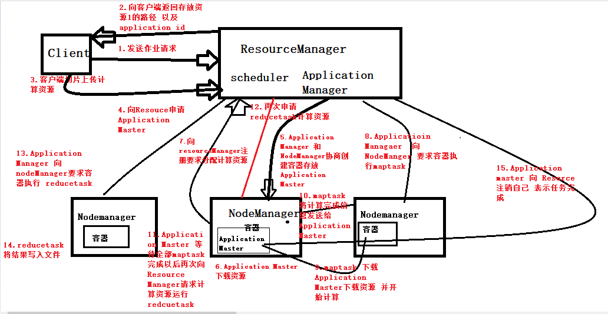
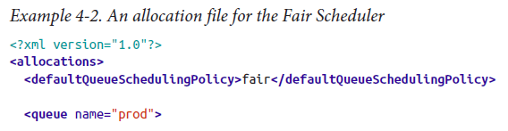
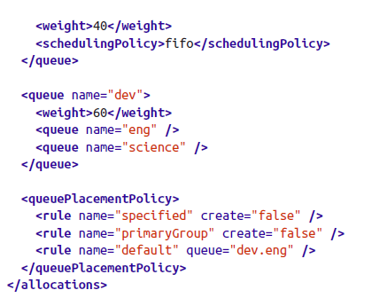
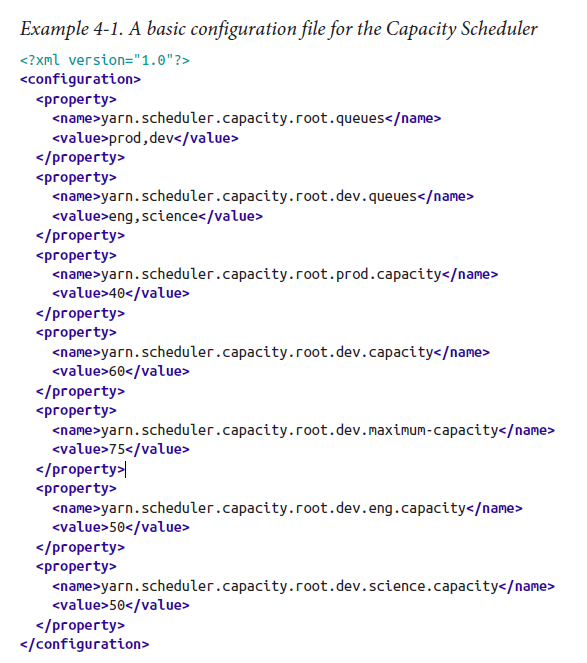

# Hadoop之Yarn

### Yarn有关进程

~~~
ResourceManage：主要接受客户端任务请求，接受和监控Nodemanager 的资源汇报情况 负责资源的分配和调度，启动和监控ApplicaionMaster
Nodemanager ：节点上的资源管理启动Container运行task计算，上报资源，container情况和任务处理情况给AM
ApplicationMaster： 主要是单个Application的task管理和调度，向Rm进行资源的申请 ，向NM发出
LaunchContainer指令 接收Nm的task处理状态信息
~~~

### Yarn的工作流程 

#### 流程图

#### 具体流程 

~~~
1. 客户端向Resource Manager发送作业请求
2. Resource Manager 向客户端返回路径用于存放资源、以及application的id
3. 客户端切片上传计算资源
4. 客户端向Resource Manager 申请 Application Master
5. Application Manager 和NodeManager协商创建容器存放Application Master
6. Applicatioin Master 下载计算资源
7. Application Master 向Resource Managaer 注册 要求分配计算资源（maptask）
8. Applicatioin Managaer 向NodeManger 要求容器执行maptask
9. maptask 下载Application Master下载资源 并开始计算
10. maptask将计算完成信息发送给 Application Master
11. Application Master 等待全部maptask完成以后再次向Resource Manager请求计算资源运行redcuetask
12. Application Master再次申请 向Application Manager reducetask计算资源
13. Application Manager 向 nodeManager要求容器执行 reducetask
14. reducetask 将结果写入文件
15. Application master 向 Resource 注销自己 表示任务完成
~~~

### 调度器

#### 先进先出调度器

~~~
hadoop1.x使用的默认调度器就是FIFO。FIFO采用队列方式将一个一个job任务按照时间先后顺序进行服务。比如排在最前面的job需要若干maptask和若干reducetask，当发现有空闲的服务器节点就分配给这个job，直到job执行完毕。先执行最先进入队列的。
~~~

#### 公平调度

##### 详解

~~~
FairScheduler是一个资源分配方式，在整个时间线上，所有的applications平均的获取资源。Hadoop NextGen能够调度多种类型的资源。默认情况下，FairScheduler只是对内存资源做公平的调度(分配)。当集群中只有一个application运行时，那么此application占用这个集群资源。当其他的applications提交后，那些释放的资源将会被分配给新的applications，所以每个applicaiton最终都能获取几乎一样多的资源。不像Hadoop默认的Scheduler(CapacityScheduler)
特点 
Ø 支持多用户多队列
Ø 资源公平共享（公平共享量由优先级决定）
Ø 保证最小共享量
Ø 支持时间片抢占
Ø 限制作业并发量，以防止中间数据塞满磁盘
~~~

##### 相关配置 

######  yarn-site.xml，开启fair调度器

~~~xml
<property>
<name>yarn.resourcemanager.scheduler.class</name>               <value>org.apache.hadoop.yarn.server.resourcemanager.scheduler.fair.FairScheduler</value>
</property>
~~~

######  fair-scheduler.xml

#### 容量调度

##### 详解

~~~
支持多个队列，每个队列可配置一定的资源量，每个队列采用FIFO调度策略，为了防止同一个用户的作业独占队列中的资源，该调度器会对同一用户提交的作业所占资源量进行限定。调度时，首先按以下策略选择一个合适队列：计算每个队列中正在运行的任务数与其应该分得的计算资源之间的比值，选择一个该比值最小的队列；然后按以下策略选择该队列中一个作业：按照作业优先级和提交时间顺序选择，同时考虑用户资源量限制和内存限制。
~~~

##### 相关配置

###### etc/hadoop/capacity-scheduler.xml

###### 容量调度相关属性

~~~
配置容量调度的属性
yarn.scheduler.capacity..capacity
它是队列的资源容量占比(百分比)。系统繁忙时，每个队列都应该得到设置的量的资源；当系统空闲时，该队列的资源则可以被其他的队列使用。同一层的所有队列加起来必须是100%。
yarn.scheduler.capacity..maximum-capacity
队列资源的使用上限。由于系统空闲时，队列可以使用其他的空闲资源，因此最多使用的资源量则是该参数控制。默认是-1，即禁用。
yarn.scheduler.capacity..minimum-user-limit-percent
每个任务占用的最少资源。比如，你设置成了25%。那么如果有两个用户提交任务，那么每个任务资源不超过50%。如果3个用户提交任务，那么每个任务资源不超过33%。如果4个用户提交任务，那么每个任务资源不超过25%。如果5个用户提交任务，那么第五个用户需要等待才能提交。默认是100，即不去做限制。
yarn.scheduler.capacity..user-limit-factor
每个用户最多使用的队列资源占比，如果设置为50.那么每个用户使用的资源最多就是50%。
~~~

#### 容量调度以及公平调度的对比 

##### 相同点 

~~~
（1）以队列划分资源
（2）设定最低保证和最大使用上限
（3）在某个队列空闲时可以将资源共享给其他队列。
~~~

##### 不同点 

~~~
（1）Fair Scheduler队列内部支持多种调度策略，包括FIFO、Fair（队列中的N个作业，每个获得该队列1 / N的资源）、DRF（Dominant Resource Fairness）（多种资源类型e.g. CPU，内存 的公平资源分配策略）
（2）Fair Scheduler支持资源抢占。当队列中有新的应用提交时，系统调度器理应为它回收资源，但是考虑到共享的资源正在进行计算，所以调度器采用先等待再强制回收的策略，即等待一段时间后入股仍没有获得资源，那么从使用共享资源的队列中杀死一部分任务，通过yarn.scheduler.fair.preemption设置为true，开启抢占功能。
（3）Fair Scheduler中有一个基于任务数量的负载均衡机制，该机制尽可能将系统中的任务分配到各个节点
（4）Fair Scheduler可以为每个队列单独设置调度策略（FIFO Fair DRF）
（5）Fair Scheduler由于可以采用Fair算法，因此可以使得小应用快速获得资源，避免了饿死的情况。
~~~

### 日志聚合

#### 相关配置

##### yarn-site.xml

~~~xml
<!--开启日志聚合功能-->
<property>
<name>yarn.log-aggregation-enable</name>
<value>true</value>
</property>
<!--指定日志保存时间-->
<property>
<name>yarn.log-aggregation.retain-seconds</name>
<value>604800</value>
</property>
~~~

##### 节点启动命令 

~~~
启动命令 
mr-jobhistory-daemon.sh start historyserver 
出现 JobHistoryServer 进程
web页面 hadoop1:19888
关闭命令 
mr-jobhistory-daemon.sh stop historyserver
~~~

### Yran的信息监控 

#### Metrics

##### 常用IP地址以及参数

~~~
http://hadoop1:50070/jmx
通过org.apache.hadoop.jmx.JMXJsonServlet 该类实现
callback 、 qry 指定队列 、 get 支持三个参数
~~~

API

~~~java
package Metric;

import org.apache.commons.httpclient.HttpClient;
import org.apache.commons.httpclient.HttpStatus;
import org.apache.commons.httpclient.methods.GetMethod;

/**
 * 使用http的方式获取hadoop的metrics信息
 */
public class MetricsDemo {

    public static void main(String[] args) {
        try {
            parserMetrics("http://hadoop01:50070/jmx?qry=Hadoop:service=NameNode,name=FSNamesystemState","utf-8");
        } catch (Exception e) {
            e.printStackTrace();
        }
    }
    public static void parserMetrics(String url, String charset) throws Exception {
        HttpClient client = new HttpClient();
        GetMethod method = new GetMethod(url);

        if (null == url || !url.startsWith("http")) {
            throw new Exception("请求地址格式不对");
        }
        // 设置请求的编码方式
        if (null != charset) {
            method.addRequestHeader("Content-Type", "application/x-www-form-urlencoded; charset=" + charset);
        } else {
            method.addRequestHeader("Content-Type", "application/x-www-form-urlencoded; charset=" + "utf-8");
        }
        int statusCode = client.executeMethod(method);

        if (statusCode != HttpStatus.SC_OK) {// 打印服务器返回的状态
            System.out.println("Method failed: " + method.getStatusLine());
        }
        // 返回响应消息
        byte[] responseBody = method.getResponseBodyAsString().getBytes(method.getResponseCharSet());
        // 在返回响应消息使用编码(utf-8或gb2312)
        String response = new String(responseBody, "utf-8");
        System.out.println(response);
        //将reponse的字符串转换成json对象
        //JSONObject jo = JSONObject.parseObject(response);
        //JSONObject jo1 = JSONObject.parseObject(jo.getString("data"));
        //赋值
    }
}

~~~

